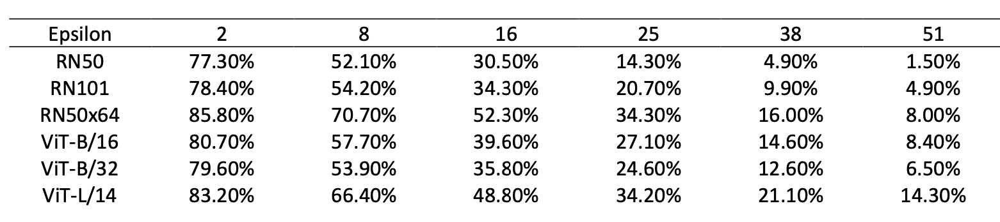
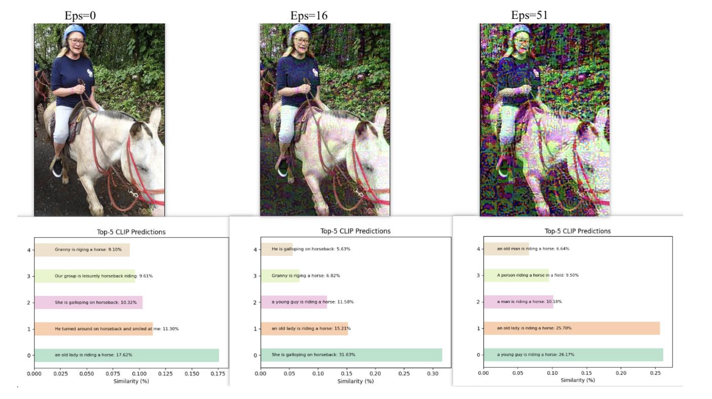

# Research: Adversarial Challenges and Evaluations on CLIP

This repository contains the code, datasets, and experimental results for research **"Adversarial Challenges and Evaluations on CLIP"**, which investigates the robustness of CLIP models against adversarial attacks through a series of zero-shot evaluation experiments.

## Abstract
With the continuous development of deep learning, more and more new models have emerged, significantly improving the performance of image classification. Notably, the CLIP model stands out in this evolution for its ability to jointly understand and correlate diverse visual and textual information through innovative contrastive pre-training.  

On the other hand, the discussion on adversarial attacks remains ongoing. Previous research predominantly focused on assessing the resilience of ViT models against adversarial samples, leaving unexplored the impact of adversarial attacks on the accuracy of the novel CLIP model.  

This work addresses this gap by conducting three experiments to test the zero-shot capability of the CLIP model under different adversarial samples:

1. **Experiment 1** — Used three different attack methods (FGSM, MI-FGSM, and PGD) to find the best transferability model among three ViT model versions.
2. **Experiment 2** — Tested whether CLIP could distinguish the adversarial samples generated by the best transferability model.
3. **Experiment 3** — Examined the defence performance of CLIP with more complex text input.

**Key findings:**
- CLIP exhibits superior robustness against adversarial samples compared to vanilla ViT models.
- CLIP's ability to discriminate adversarial samples is not directly correlated with the size of the underlying image classification model.
- With increased adversarial perturbation, CLIP shows noticeable attenuation in discerning fine details (e.g., age, gender).

## Results

**Table 4** — Accuracy with variants of Epsilon for different CLIP base models against FGSM  


**Figure 2** — CLIP zero-shot Top-5 predictions on adversarial samples  


## Getting Started

### Installation
```bash
git clone https://github.com/pahuang-96485/6tb1cbiy7a-11252023.git
```
### Sample testing command
```bash
cd Test
python test.py --test_dir "./dataset/ImageNet1K-Val" --dataset "imagenet_1k" --src_model vit_base_patch16_384 --tar_model vit_base_patch16_384 --attack_type "PGD" --eps 16 --index "all" --batch_size 5
```
### Sample evaluation command
```bash
cd Evaluation
python test-single-imageTpp5-plot.py
```
### Acknowledgements
This repository reuses and adapts code from:
- [ATViT: Improving Adversarial Robustness of Vision Transformers via Patch-wise Masking](https://github.com/Muzammal-Naseer/ATViT) — Naseer *et al.*, CVPR 2021.
- [OpenAI CLIP](https://github.com/openai/CLIP)
- [Adversarial Robustness Toolbox](https://github.com/Trusted-AI/adversarial-robustness-toolbox)

We thank the authors for making their code and models publicly available.

### Citation
If you use this work in your research, please also cite:

```bibtex
@inproceedings{naseer2021improving,
  title={Improving adversarial robustness of vision transformers via patch-wise masking},
  author={Naseer, Muzammal and Ranasinghe, Kanchana and Khan, Salman and Hayat, Munawar and Khan, Fahad Shahbaz and Yang, Ming-Hsuan},
  booktitle={Proceedings of the IEEE/CVF Conference on Computer Vision and Pattern Recognition (CVPR)},
  pages={7999--8008},
  year={2021}
}
```